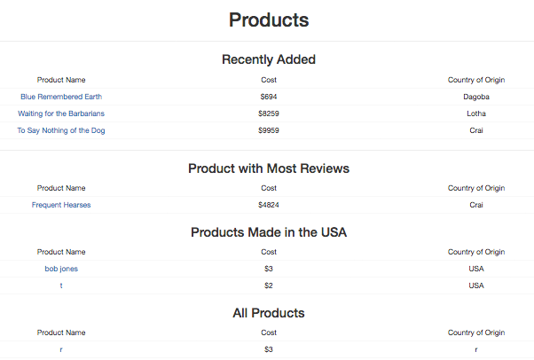
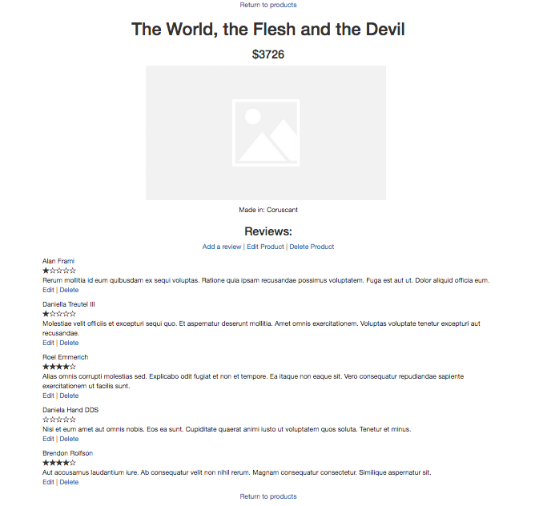

# Mario's Specialty Food Products

This is a project created by Logan Tanous on 4/20/18 while attending the Epicodus code school.

<center><i>Landing Page</i></center>


<center><i>Product Page</i></center>


##Features

<ul>
  <li>one-to-many relationship between Products and Reviews</li>
  <li>landing page that utilizes scope to display:
    <ul>
      <li>three most recently added products</li>
      <li>the product with the most reviews</li>
      <li>products that originate from the USA</li>
      <li>an all product section</li>
    </ul>
  </li>
  <li>Each product has its own page with:
    <ul>
      <li>more information</li>
      <li>editable reviews with star ratings</li>
    </ul>
  </li>
  <li>seeded content utilizing <a href="https://github.com/stympy/faker">Faker</a></li>
  <li>Validations to make sure
    <ul>
      <li>All fields are filled out</li>
      <li>Rating can only be an integer between 1 and 5</li>
      <li>The review's content_body stays between 50 and 250 characters.</li>
    </ul>
  </li>
  <li>Success and error flash messages that hide themselves after 3 seconds</li>
  <li>/products set as root homepage</li>
  <li>Presentable bootstrap responsive styling</li>
</ul>

## Setup/Installation
To clone onto your local machine, run the following in the terminal
```
 $ git clone https://github.com/logmannn/Mario-s-Speciality-Food-Products-April-20-Friday-Project
```
Go into the project folder with cd [location of the file]
```
$ rake db:create
$ rake db:migrate db:test:prepare
$ rake db:seed
```
Run the rails server
`
$ rails s
`
<br><br>
Open in the browser
<br><br>
<center><i>Use for educational purposes</i></center>
